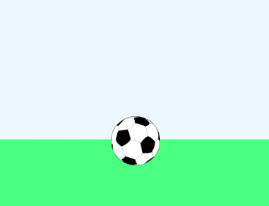

# Bouncing ball

An example for a toy [bevy](https://bevyengine.org) project.

The ball image is licensed under [CC0 Public Domain](https://creativecommons.org/publicdomain/zero/1.0/) and taken from https://www.publicdomainpictures.net/de/view-image.php?image=50111&picture=fussball-clipart.

## [MIT Licensed](LICENSE)
